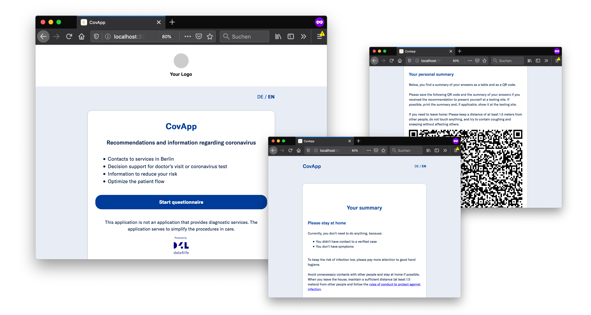

# CovApp

> 😷 Solution for assessing the risk of contagious viral infections (COVID-19)



[The CovApp](https://covapp.charite.de/) is an application developed in collaboration by [Charité – Universitätsmedizin Berlin](https://www.charite.de/) and [Data4Life](https://www.data4life.care/). It can help users to assess their medical condition better, provide recommendations regarding doctor’s visits or coronavirus testing by answering a few questions.

Additionally, every filled out questionnaire summarizes relevant medical information for future doctor’s consultation in the form of a summary page, printout or a QR code. Institutions with the technical setup can scan the provided QR code and retrieve the patient information quickly and without any physical contact.

By implementing the CovApp, any medical institution can reduce the number of new incoming patients, avoid physical contact and speed up the patient registration process.

---

This repository holds a white-labeled version of the original application, free to use licensed under [MIT License](#license). Application logic, print functionality and QR code generation are still provided.

The application and underlying questionnaire logic [are versioned and future updates will be provided](#application-updates).

⚠️ **Any institution/doctor’s office is free to implement CovApp on their domains – the medical responsibility and legal liability lie with the implementing institution.**

⚠️ **This application is only meant to be set up by software developers. Unfortunately, we can't provide a non-technical solution now.**

## Technical overview

The application runs dynamically in the browser. **It can be built and deployed to any service that provides a static web server with custom routing**.

It is based on a JavaScript software stack and uses the following technologies:

- [Stencil](https://stenciljs.com/)
- [TypeScript](https://www.typescriptlang.org/)
- [WebComponents](https://www.webcomponents.org/)

## Installation and development

To get further information on how to set up and deploy your custom CovApp application, see the [development documentation](./docs/DEVELOPMENT.md).

## Customization

The CovApp provides the following customization options:

- change words or add a new language

⚠️ **Note that there are several placeholder texts you must provide yourself.**

⚠️ **Note that the default fallback language is English (en) and it has to be available.**

- change colors
- change the application logo

To learn more about these options, see the [customization documentation](./docs/CUSTOMIZATION.md).

### Questionnaire answers in FHIR format

In addition to the XML representation of the questionnaire answers that is stored in the QR code, there is the possibility to generate a [FHIR R4](http://hl7.org/fhir/R4/) representation. You find documentation for the FHIR version of the questionnaire and its resources on [Simplifier.net](https://simplifier.net/guide/Covid-19Pre-TestPatientAssessment/Home).
In the `src/global/fhir` folder, you find a module that lets you create a [FHIR R4 QuestionnaireResponse](http://hl7.org/fhir/R4/questionnaireresponse.html) resource which contains the answers.

To generate the FHIR format, add the following code to the `src/components/qr-code/qr-code.tsx` file:

```typescript
import { createFHIRQuestionnaireResponse } from '../../global/fhir';

createFHIR = () => {
  const valuePairs = this.generateValuePairs(this.answers);
  const fhir = createFHIRQuestionnaireResponse(valuePairs, this.language);
  return fhir;
};
```

Note: Since you’re changing the code outside of the general customization process, this might bring merge conflicts for future app updates.

## Support and contributing

Due to today's urgency and dynamic nature, **we cannot offer support for this repository**. We'll continue the development of the official CovApp internally. Changes and releases will be white-labeled and propagated into this repository.

We won't be able to react to issues and/or pull requests, but **we would still encourage you to provide feedback**. We will monitor the appearing problems, new ideas and possible feature requests and might consider them for future releases. **Feel free to collaborate and work on your forks to move forward with custom development.**

Before you open an issue, see the [customization documentation](./docs/CUSTOMIZATION.md).

## Application updates

While the development of the original CovApp continues internally, we'll provide regularly updated GitHub releases. If you followed [the setup instructions and created a fork of this repository on GitHub](./docs/DEVELOPMENT.md), an automation process will open pull requests in your repository whenever then application and the underlying questionnaire received an update. This way, you'll be informed about updates and the development process stays as easy as possible.

Additionally, [GitHub provides documentation on how to sync forks manually](https://help.github.com/en/github/collaborating-with-issues-and-pull-requests/syncing-a-fork).

## Frequently asked questions

If you have further questions, you can find additional [information on d4l.io](https://d4l.io/blog/covapp-faq).

## Code of conduct

[Contributor Code of Conduct](./CODE-OF-CONDUCT.md). By participating in this project, you agree to abide by its terms.

## License

The CovApp is [MIT licensed](./LICENSE).

## Copyright

Copyright 2020 by Charité Universitaetsmedizin Berlin and [D4L data4life gGmbH](https://www.data4life.care)

Contributors: Dr. Alexander Henry Thieme and others
